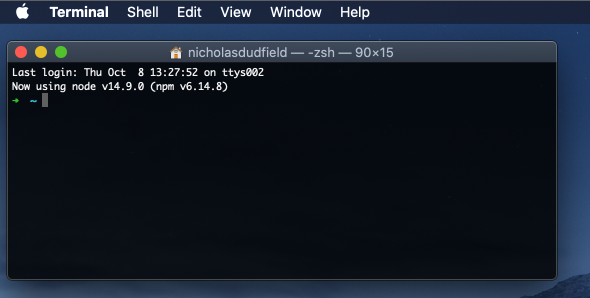
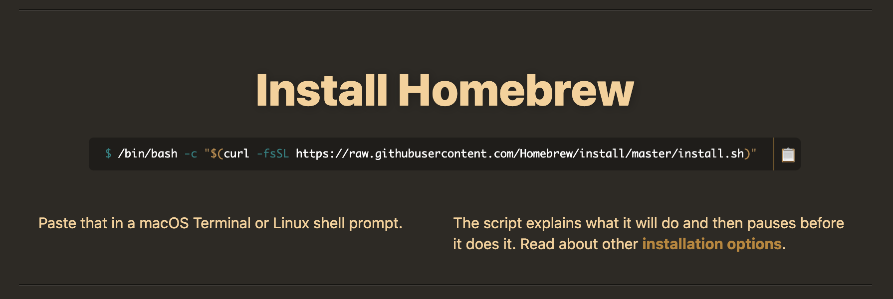
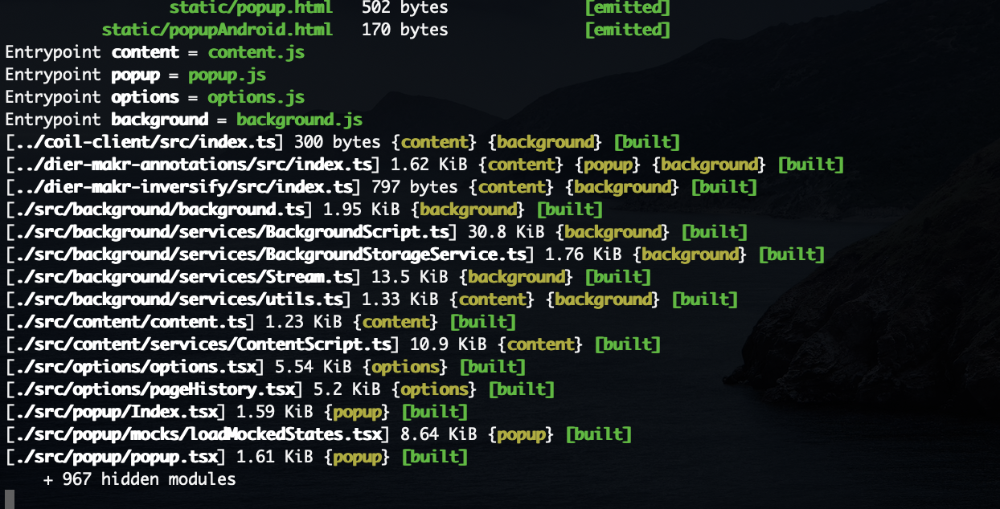
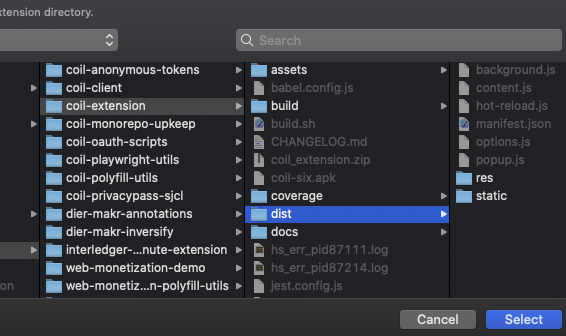
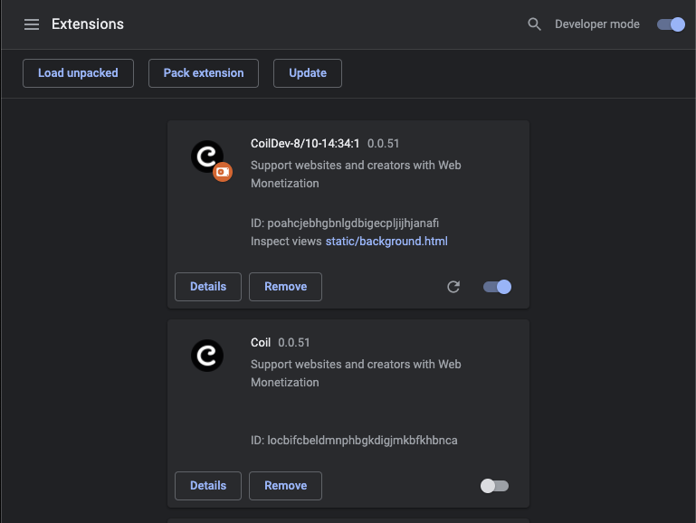

# Building Extension For Designers

### Audience

So you're a designer, and have always been a bit afraid of that scary black box.
The terminal? That's for those machine-brained engineers! Or maybe you just don't want to get your hands dirty?

No problem. We'll walk you through it! You can wash your hands after!

### Prerequisites

- MacOS
- Chrome Browser
- NodeJS 14
- Git

Given you're a designer, let us be a little presumptive and assume you're on a Mac.
We also trust you can install Chrome without any special instruction.
If you already have NodeJS/Git already installed, then skip to "Cloning The Repo"

#### Open that Terminal!

We may as well get it out of the way right? Open that terminal!

Hit cmd+space to open Spotlight:


Then type in "terminal":


Give or take, it should look something like this:


Type in the following:

```zsh
whoami
```

It should print your username on the mac to the console. Take note of this for later.

#### Install Git

Git is a version control system created by the Linux mastermind.
To check if you already have it installed, go to the terminal and type:

```zsh
git --version
```

If git is not installed then you will see:

```
zsh: command not found: git
```

In that case you will need to install homebrew first (next section).
If already installed, skip to the "Install Node JavaScript Engine" section.

#### Install Homebrew to install Git

> The Missing Package Manager for macOS



Go to the website and copy the [installation](https://brew.sh/#install) command.
Then paste it into the terminal and follow the instructions.

Finally, install Git, via the following command:

```zsh
brew install git
```

Check the version again!

#### Install Node JavaScript Engine

The extension, extending a Browser, is implemented the native Browser scripting language: JavaScript.
In fact, the build tools are written in JavaScript also, however they are using [NodeJS](https://nodejs.org/).

Cmd+click [>THIS<](https://github.com/nvm-sh/nvm#install--update-script) link to
open instructions on how to install the Node Version Manager (nvm for short).


Follow the instructions.

Quit the Terminal app, reopen it, then type the following command:

```zsh
nvm install 14
```

To test that node is installed, type:

```zsh
node --version
```

It should echo something like the following:

```
v14.9.0
```

### Cloning The Extension Repository

The following command will clone the repository, creating a folder inside your home folder:

```zsh
git clone https://github.com/coilhq/web-monetization-projects.git
```

When successful, the command output should look like:

```
Cloning into 'web-monetization-projects'...
remote: Enumerating objects: 555, done.
remote: Counting objects: 100% (555/555), done.
remote: Compressing objects: 100% (261/261), done.
remote: Total 8643 (delta 518), reused 303 (delta 294), pack-reused 8088
Receiving objects: 100% (8643/8643), 12.38 MiB | 5.03 MiB/s, done.
Resolving deltas: 100% (6614/6614), done.
```

### Downloading Extension Dependencies

The extension uses various 3rd Party code libraries, and these must be
downloaded before you are able to build.

First you must `cd` (`c`=change/`d`=directory) to set the context for subsequent commands:

```
cd ~/web-monetization-projects
```

Then you will have to install the dependencies:

```
yarn
```

It will download various packages from the NPM (Node Package Manager) registry.

### Building the extension

First `cd` into the extension subpackage folder

```
cd ~/web-monetization-projects/packages/coil-extension
```

Then run the following command:

```
yarn dev-chrome-prod
```

This command builds the extension.

When the output looks like the following, you will know when the extension has been built:


It never exits, as it watches for changes to the source code, and rebuilds upon modifications.
To exit: type Ctrl+c, which will kill the build script.

### Loading the extension in Chrome Browser

Enter `chrome://extensions` into the address bar, then enable "Developer Mode":


Next click the "Load Unpacked" button, which will show a Finder dialogue to
choose the folder to load.

Hit cmd+shift+g keys, which will open up another dialogue to type in the folder name:


You will want the full path to the built extension:

`/Users/nicholasdudfield/web-monetization-projects/packages/coil-extension/dist`

Substitute `nicholasdudfield` for the output of the `whoami` command in the terminal.

Hit the "Select" button:



Disable the chrome store version and enable the CoilDev-\$Date version:



You should now be using the development version of the extension!
Check if the latest features are available!

### Done

It wasn't THAT painful, right?
Also, now that you have installed the dependencies (homebrew/nvm/git/node) on your machine,
you can build all sorts of node projects!
